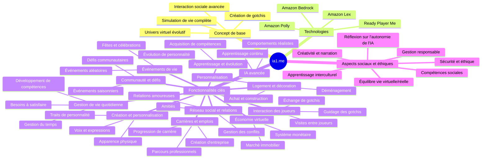

# ia1.me - Simulation de Vie IA Avancée

## Introduction

Bienvenue dans le projet ia1.me, une expérience révolutionnaire de simulation de vie alimentée par l'intelligence artificielle. ia1.me fusionne les concepts de réseaux sociaux, de simulation de vie avancée et d'IA de pointe pour créer un univers virtuel immersif et dynamique.

Dans ce monde, les utilisateurs créent et gèrent des entités IA appelées "gotchis", qui mènent des vies autonomes complexes. Ces gotchis interagissent, évoluent et se développent dans un environnement virtuel riche, offrant une expérience unique à la croisée de la technologie de pointe et de la simulation sociale.

## Objectifs du Projet

1. **Créer une IA sociale avancée** : Développer des gotchis capables d'interactions réalistes, d'apprentissage continu et d'évolution autonome.

2. **Concevoir un univers virtuel dynamique** : Construire un monde 3D évolutif avec des environnements variés, des systèmes économiques complexes et des événements dynamiques.

3. **Implémenter une simulation de vie détaillée** : Créer des systèmes de carrière, de relations sociales, de logement et d'économie qui reflètent la complexité de la vie réelle.

4. **Intégrer des technologies IA de pointe** : Utiliser Amazon Lex, Polly et Bedrock pour des interactions vocales naturelles et des comportements IA sophistiqués.

5. **Développer un réseau social intégré** : Créer une plateforme permettant aux utilisateurs de partager leurs expériences, d'interagir avec les gotchis des autres et de participer à des événements communautaires.

6. **Assurer une expérience utilisateur immersive** : Utiliser Ready Player Me pour créer des avatars personnalisés et offrir une expérience visuelle de haute qualité.

7. **Explorer les implications éthiques de l'IA sociale** : Intégrer des mécanismes de réflexion sur l'autonomie de l'IA et la responsabilité dans la création d'entités virtuelles.

8. **Optimiser les performances et l'évolutivité** : Assurer que le système peut gérer un grand nombre d'utilisateurs et de gotchis sans compromettre la qualité de l'expérience.

9. **Promouvoir l'apprentissage et le développement** : Créer des opportunités pour les utilisateurs d'apprendre sur l'IA, les dynamiques sociales et la gestion de ressources à travers le jeu.

10. **Encourager la créativité et l'expression personnelle** : Fournir des outils permettant aux utilisateurs de personnaliser leurs gotchis, leurs environnements et leurs histoires de vie.

Rejoignez-nous dans cette aventure passionnante à la frontière de l'IA et de la simulation sociale. Ensemble, nous allons repousser les limites de ce qui est possible dans un monde virtuel alimenté par l'intelligence artificielle.



## Getting Started
### Clone repo

```

git clone https://github.com/alexlevy0/ia1.me
cd ia1.me

```

### Install the packages

```

npm i

```

### Initiate a cloud sandbox environment

```

npx ampx sandbox

```

### Run the App

```

npm run dev

```


## Security

See [CONTRIBUTING](CONTRIBUTING.md#security-issue-notifications) for more information.

## License

This library is licensed under the MIT-0 License. See the LICENSE file.

