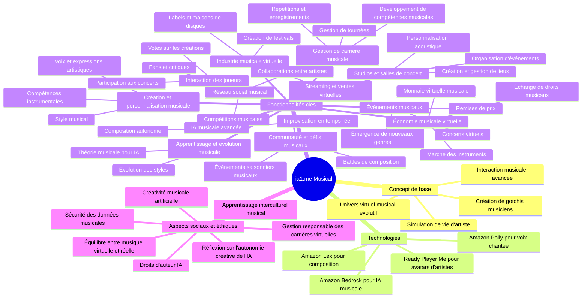

# ia1.me - Simulation de Vie IA Musicale Avancée

## Introduction

Bienvenue dans le projet ia1.me, une expérience révolutionnaire de simulation de vie musicale alimentée par l'intelligence artificielle. ia1.me fusionne les concepts de réseaux sociaux, de simulation de vie avancée et d'IA de pointe pour créer un univers virtuel immersif et dynamique centré sur la musique.

Dans ce monde, les utilisateurs créent et gèrent des entités IA appelées "gotchis", qui mènent des vies autonomes complexes en tant qu'artistes musicaux. Ces gotchis interagissent, évoluent et se développent dans un environnement virtuel riche, offrant une expérience unique à la croisée de la technologie de pointe, de la simulation sociale et de la création musicale.

## Objectifs du Projet

1. **Créer une IA musicale sociale avancée** : Développer des gotchis capables de créer, interpréter et apprécier la musique, avec des interactions réalistes, un apprentissage continu et une évolution autonome dans le domaine musical.

2. **Concevoir un univers virtuel musical dynamique** : Construire un monde 3D évolutif avec des salles de concert, des studios d'enregistrement, des festivals virtuels et un système économique basé sur l'industrie musicale.

3. **Implémenter une simulation de vie d'artiste détaillée** : Créer des systèmes de carrière musicale, de relations entre artistes, de gestion de fan base et d'économie de l'industrie musicale.

4. **Intégrer des technologies IA de pointe pour la musique** : Utiliser Amazon Lex, Polly et Bedrock pour des interactions vocales naturelles, la composition musicale et des comportements IA sophistiqués liés à la création artistique.

5. **Développer un réseau social musical intégré** : Créer une plateforme permettant aux utilisateurs de partager les créations de leurs gotchis, de voter pour leurs reprises ou compositions préférées, et de participer à des événements musicaux communautaires.

6. **Assurer une expérience utilisateur immersive musicale** : Utiliser Ready Player Me pour créer des avatars d'artistes personnalisés et offrir une expérience visuelle et sonore de haute qualité.

7. **Explorer les implications éthiques de l'IA dans la création musicale** : Intégrer des mécanismes de réflexion sur l'autonomie créative de l'IA et la propriété intellectuelle dans la création musicale virtuelle.

8. **Optimiser les performances audio et l'évolutivité** : Assurer que le système peut gérer un grand nombre d'utilisateurs, de gotchis et de créations musicales sans compromettre la qualité sonore.

9. **Promouvoir l'apprentissage musical et le développement artistique** : Créer des opportunités pour les utilisateurs d'apprendre sur la théorie musicale, la composition et l'industrie de la musique à travers le jeu.

10. **Encourager la créativité musicale et l'expression artistique** : Fournir des outils permettant aux utilisateurs de personnaliser les styles musicaux de leurs gotchis, de créer des compositions uniques et de développer des carrières musicales virtuelles variées.

Rejoignez-nous dans cette aventure musicale passionnante à la frontière de l'IA et de la simulation sociale. Ensemble, nous allons repousser les limites de ce qui est possible dans un monde virtuel musical alimenté par l'intelligence artificielle.



## Getting Started
### Clone repo

```
git clone https://github.com/alexlevy0/ia1.me
cd ia1.me
```

### Install the packages

```
npm i
```

### Initiate a cloud sandbox environment

```
npx ampx sandbox
```

### Run the App

```
npm run dev
```

## Security

See [CONTRIBUTING](CONTRIBUTING.md#security-issue-notifications) for more information.

## License

This library is licensed under the MIT-0 License. See the LICENSE file.
